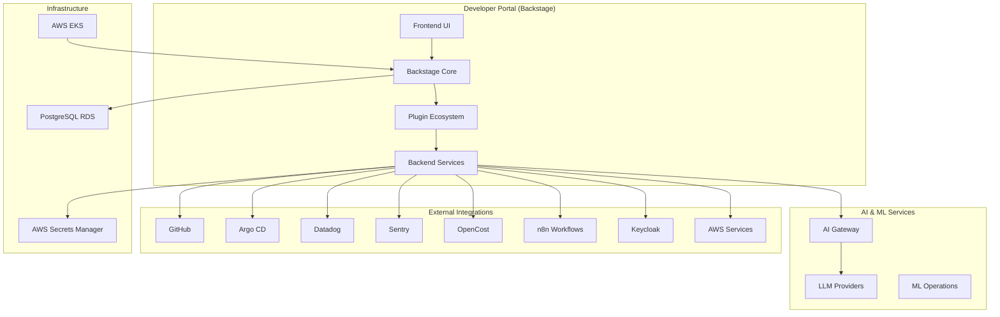

# Design Document: Internal Developer Platform

## Overview

This document outlines the design for an Internal Developer Platform (IDP) built on Backstage for a 50-person SaaS development company. The platform integrates with existing infrastructure including GitHub, Argo CD, AWS EKS, Datadog, and other tools to provide a unified developer experience with AI-powered capabilities.

The design follows a microservices architecture pattern with clear separation between the Backstage core, custom plugins, and external integrations. The platform emphasizes developer self-service, observability, cost transparency, and AI-assisted operations.

## Architecture

### High-Level Architecture



### Component Architecture

The platform consists of several key architectural layers:

1. **Presentation Layer**: React-based Backstage frontend with Material-UI components
2. **Application Layer**: Backstage core with plugin orchestration
3. **Integration Layer**: Custom and community plugins for external tool integration
4. **AI/ML Layer**: Centralized AI gateway with multiple LLM provider support
5. **Data Layer**: PostgreSQL for catalog data, external APIs for operational data
6. **Infrastructure Layer**: Kubernetes-based deployment on AWS EKS

## Components and Interfaces

### Core Backstage Components

#### Service Catalog
- **Purpose**: Central registry of all services, APIs, and components
- **Data Sources**: GitHub repositories with catalog-info.yaml files
- **Discovery**: Automated discovery via GitHub API integration
- **Schema**: Backstage entity model with custom annotations for cost, ownership, and dependencies

#### Scaffolder (Golden Paths)
- **Templates**: Standardized project templates for Java, Go, React, React Native
- **Actions**: Custom actions for repository creation, CI/CD setup, and service registration
- **Integration**: GitHub API for repository creation, Argo CD for deployment setup

#### TechDocs
- **Source**: Markdown documentation in service repositories (/docs directory)
- **Build**: MkDocs-based static site generation
- **Storage**: S3 bucket for generated documentation assets
- **Search**: Integrated with Backstage search for documentation discovery

### Custom Plugin Components

#### AI Assistant Plugin (@internal/plugin-ai-assistant)
```typescript
interface AIAssistantAPI {
  generateCode(prompt: string, context: ServiceContext): Promise<CodeSuggestion>;
  generateDocumentation(codebase: string): Promise<Documentation>;
  analyzeError(error: ErrorContext): Promise<RootCauseAnalysis>;
  reviewCode(pullRequest: PRContext): Promise<CodeReview>;
}

interface ServiceContext {
  serviceName: string;
  language: string;
  framework: string;
  dependencies: string[];
}
```

#### OpenCost Integration Plugin (@internal/plugin-opencost)
```typescript
interface OpenCostAPI {
  getServiceCosts(serviceName: string, timeRange: TimeRange): Promise<CostData>;
  getCostTrends(serviceName: string): Promise<CostTrend[]>;
  getOptimizationRecommendations(serviceName: string): Promise<Optimization[]>;
}

interface CostData {
  totalCost: number;
  cpuCost: number;
  memoryCost: number;
  storageCost: number;
  networkCost: number;
}
```

#### n8n Workflow Plugin (@internal/plugin-n8n-actions)
```typescript
interface N8NWorkflowAPI {
  triggerWorkflow(workflowId: string, payload: any): Promise<WorkflowExecution>;
  getWorkflowStatus(executionId: string): Promise<ExecutionStatus>;
  listAvailableWorkflows(): Promise<Workflow[]>;
}

interface WorkflowExecution {
  executionId: string;
  status: 'running' | 'completed' | 'failed';
  result?: any;
  error?: string;
}
```

#### Feishu Migration Plugin (@internal/plugin-feishu-migration)
```typescript
interface FeishuMigrationAPI {
  scanFeishuWorkspace(workspaceId: string): Promise<FeishuDocument[]>;
  convertDocument(document: FeishuDocument, config: ConversionConfig): Promise<MarkdownDocument>;
  migrateDocuments(documents: FeishuDocument[], targetService: string): Promise<MigrationResult>;
  validateMigration(migrationId: string): Promise<ValidationReport>;
}

interface ConversionConfig {
  preserveFormatting: boolean;
  handleImages: 'download' | 'link' | 'embed';
  convertTables: boolean;
  preserveComments: boolean;
}

interface MigrationResult {
  migrationId: string;
  successCount: number;
  failureCount: number;
  warnings: string[];
  generatedFiles: string[];
}
```
```typescript
interface AIOpsAPI {
  detectAnomalies(serviceName: string): Promise<Anomaly[]>;
  predictFailures(serviceName: string): Promise<FailurePrediction[]>;
  generateRunbook(incident: IncidentContext): Promise<Runbook>;
  optimizeResources(serviceName: string): Promise<ResourceOptimization>;
}

interface Anomaly {
  type: 'performance' | 'cost' | 'error_rate';
  severity: 'low' | 'medium' | 'high';
  description: string;
  recommendation: string;
  confidence: number; // 0-1 confidence score
  dataFreshness: Date;
}
```

#### Security and Compliance Plugin (@internal/plugin-security)
```typescript
interface SecurityAPI {
  filterSensitiveContent(content: string): Promise<string>;
  validateUserPermissions(userId: string, action: string, resource: string): Promise<boolean>;
  auditAIInteraction(userId: string, prompt: string, response: string): Promise<void>;
  checkContractorAccess(userId: string, resourceType: string): Promise<AccessResult>;
}

interface AccessResult {
  allowed: boolean;
  reason?: string;
  requiresApproval?: boolean;
  approvers?: string[];
}
```

### Integration Interfaces

#### GitHub Integration
- **Authentication**: GitHub OAuth with organization access
- **Repository Discovery**: Automated scanning for catalog-info.yaml files
- **Webhook Integration**: Real-time updates for repository changes
- **API Usage**: GitHub GraphQL API for efficient data fetching

#### Argo CD Integration
- **Authentication**: Service account with read access to Argo CD API
- **Application Mapping**: Service name to Argo CD application mapping via annotations
- **Status Polling**: Real-time sync status and health information
- **Deployment Actions**: Trigger sync operations through Backstage UI

#### Datadog Integration
- **Authentication**: API key with read permissions
- **Dashboard Embedding**: Service-specific dashboard embedding via iframe
- **Metrics API**: Custom metrics queries for service health
- **Alert Integration**: Alert status and escalation information

## Data Models

### Service Entity Model
```yaml
apiVersion: backstage.io/v1alpha1
kind: Component
metadata:
  name: user-service
  annotations:
    github.com/project-slug: company/user-service
    argocd/app-name: user-service-prod
    datadog/dashboard-url: https://app.datadoghq.com/dashboard/abc-123
    sentry/project-slug: company/user-service
    opencost/service-label: user-service
    n8n/workflows: user-onboarding,user-offboarding
spec:
  type: service
  owner: team-backend
  lifecycle: production
  dependsOn:
    - resource:user-database
    - component:auth-service
  providesApis:
    - user-api
```

### Cost Data Model
```typescript
interface ServiceCostData {
  serviceName: string;
  timeRange: {
    start: Date;
    end: Date;
  };
  costs: {
    compute: CostBreakdown;
    storage: CostBreakdown;
    network: CostBreakdown;
    total: number;
  };
  trends: CostTrend[];
  recommendations: CostOptimization[];
}

interface CostBreakdown {
  amount: number;
  currency: string;
  unit: string;
  details: Record<string, number>;
}
```

### AI Context Model
```typescript
interface AIContext {
  serviceName: string;
  codebase: {
    language: string;
    framework: string;
    dependencies: string[];
    patterns: string[];
  };
  operational: {
    metrics: MetricData[];
    logs: LogData[];
    errors: ErrorData[];
  };
  historical: {
    incidents: Incident[];
    deployments: Deployment[];
    changes: Change[];
  };
  dataFreshness: {
    logs: string; // e.g., 'last_7d'
    metrics: string; // e.g., 'last_30d'
    incidents: string; // e.g., 'last_90d'
    lastUpdated: Date;
  };
  userContext: {
    role: string;
    team: string;
    permissions: string[];
  };
}
```

### Feishu Migration Model
```typescript
interface FeishuMigrationConfig {
  sourceDocuments: FeishuDocument[];
  targetStructure: {
    serviceName: string;
    docsPath: string;
    preserveHierarchy: boolean;
  };
  conversionRules: {
    tableToMarkdown: boolean;
    imageHandling: 'embed' | 'link' | 'download';
    commentHandling: 'preserve' | 'remove' | 'convert_to_notes';
  };
  permissionMapping: {
    feishuRole: string;
    backstageRole: string;
  }[];
}

interface FeishuDocument {
  id: string;
  title: string;
  content: string;
  permissions: FeishuPermission[];
  lastModified: Date;
}
```

### RBAC Model for External Contractors
```typescript
interface ContractorRBACPolicy {
  defaultRole: 'contractor-viewer' | 'contractor-developer';
  permissions: {
    canCreateServices: boolean;
    canViewCostData: boolean;
    canTriggerDeployments: boolean;
    canAccessProduction: boolean;
    allowedNamespaces: string[];
    dataRetentionDays: number;
  };
  accessBoundaries: {
    restrictedServices: string[];
    allowedIntegrations: string[];
    requiresApproval: string[]; // actions requiring approval
  };
}
```

## Correctness Properties

*A property is a characteristic or behavior that should hold true across all valid executions of a system—essentially, a formal statement about what the system should do. Properties serve as the bridge between human-readable specifications and machine-verifiable correctness guarantees.*

Based on the prework analysis, all acceptance criteria are testable as properties. After reviewing for redundancy, the following properties provide comprehensive validation coverage:

### Service Catalog Properties

Property 1: Service catalog completeness
*For any* set of registered services, the Service_Catalog should display all services with their complete metadata when accessed by a developer
**Validates: Requirements 1.1**

Property 2: Service discovery automation
*For any* valid catalog-info.yaml file created in a GitHub repository, the Service_Catalog should automatically discover and register the service within 5 minutes
**Validates: Requirements 1.2, 1.5**

Property 3: Service information display
*For any* service in the catalog, viewing the service should display owner information, repository links, deployment status, and dependency graph (if dependencies exist)
**Validates: Requirements 1.3, 1.4**

### Project Creation Properties

Property 4: Template availability
*For any* project creation request, the Developer_Portal should provide all required Golden_Path templates (Java, Go, React, React Native) with complete project structure generation
**Validates: Requirements 2.1, 2.2**

Property 5: Generated project completeness
*For any* template used for project creation, the generated project should include all required files (Dockerfile, CI/CD configuration, Helm charts, catalog-info.yaml) and integrations (GitHub Actions, Argo CD, Datadog, Sentry)
**Validates: Requirements 2.3, 2.5**

Property 6: Project registration automation
*For any* completed project creation, the new service should be automatically registered in the Service_Catalog
**Validates: Requirements 2.4**

### Deployment and GitOps Properties

Property 7: Deployment status visibility
*For any* service with Argo CD integration, the Developer_Portal should display current deployment status, real-time sync information during deployments, and error messages with log links for failed deployments
**Validates: Requirements 3.1, 3.2, 3.3**

Property 8: Multi-environment support
*For any* service with multiple environments, the Developer_Portal should show status for all environments (development, staging, production) and allow manual sync operations for owned services
**Validates: Requirements 3.4, 3.5**

### Observability Properties

Property 9: Monitoring integration completeness
*For any* service with monitoring integration, the Developer_Portal should embed relevant Datadog dashboards, display Sentry errors with resolution status, provide direct links to logs, and show alert status during health degradation
**Validates: Requirements 4.1, 4.2, 4.3, 4.4**

Property 10: RBAC enforcement
*For any* user accessing monitoring data, the Developer_Portal should respect existing RBAC permissions from Datadog and Sentry
**Validates: Requirements 4.5**

### Documentation Properties

Property 11: Documentation automation
*For any* service repository containing a /docs directory, the Developer_Portal should automatically generate and host documentation using TechDocs, rebuild within 10 minutes when updated, and support full Markdown features
**Validates: Requirements 5.1, 5.2, 5.3**

Property 12: Documentation search and migration
*For any* documentation content, the search functionality should index and search across all service documentation, and the system should support migration from Feishu documents
**Validates: Requirements 5.4, 5.5**

### Cost Visibility Properties

Property 13: Cost data display
*For any* service, the Developer_Portal should display monthly Kubernetes costs from OpenCost data, highlight significant cost trend changes, and show AWS resource costs when associated
**Validates: Requirements 6.1, 6.2, 6.4**

Property 14: Cost benchmarking and freshness
*For any* service comparison, the Developer_Portal should provide cost benchmarking across similar service types, and cost data should be updated daily with complete breakdowns (CPU, memory, storage)
**Validates: Requirements 6.3, 6.5**

### Workflow Automation Properties

Property 15: Workflow integration completeness
*For any* workflow operation, the Developer_Portal should trigger n8n workflows for access requests, update permissions automatically upon completion, provide self-service actions for common scenarios, and show progress status with notifications
**Validates: Requirements 7.1, 7.2, 7.3, 7.4**

Property 16: Custom workflow support
*For any* custom action defined by the Platform_Team, the workflow integration should support and execute the action correctly
**Validates: Requirements 7.5**

### Authentication Properties

Property 17: Authentication and SSO
*For any* user access, the Developer_Portal should authenticate via GitHub OAuth or Keycloak OIDC, use single sign-on for integrated tools, and support both internal employees and external contractors with appropriate boundaries
**Validates: Requirements 8.1, 8.3, 8.5**

Property 18: Permission management
*For any* user role change, the Developer_Portal should reflect updated permissions within 5 minutes and enforce role-based access controls for sensitive information
**Validates: Requirements 8.2, 8.4**

### Search Properties

Property 19: Search comprehensiveness
*For any* search query, the Developer_Portal should return results from all content types (services, documentation, APIs, team information), rank by relevance and recent activity, support category filtering, and provide suggestions when no results are found
**Validates: Requirements 9.1, 9.2, 9.3, 9.4**

Property 20: Search index management
*For any* content addition or update, the search functionality should index content from all integrated tools and update indexes in real-time
**Validates: Requirements 9.5**

### AI Assistant Properties

Property 21: AI development assistance
*For any* development task, the Developer_Portal should provide AI-generated code suggestions based on requirements and patterns, generate API documentation from code annotations, and integrate AI code review suggestions with GitHub Actions workflows
**Validates: Requirements 10.1, 10.2, 10.4**

Property 22: AI troubleshooting and learning
*For any* troubleshooting request, the Developer_Portal should provide AI-powered root cause analysis, and the AI assistance should learn from company-specific patterns to provide contextually relevant suggestions
**Validates: Requirements 10.3, 10.5**

### AIOps Properties

Property 23: AI operations intelligence
*For any* service with operational data, the Developer_Portal should use AI to predict failures from anomalies, generate runbooks from historical incidents, identify optimization opportunities, and assess deployment risks
**Validates: Requirements 11.1, 11.2, 11.3, 11.4**

Property 24: Signal correlation
*For any* monitoring data, the AIOps system should integrate with Datadog and Sentry to correlate signals across monitoring, logging, and error tracking systems
**Validates: Requirements 11.5**

### Resource Optimization Properties

Property 25: AI resource optimization
*For any* service with inefficient resource usage, the Developer_Portal should provide AI-generated optimization recommendations, identify cost drivers from anomalies, and provide auto-scaling recommendations based on traffic patterns
**Validates: Requirements 12.1, 12.2, 12.3**

Property 26: Performance benchmarking and cost analysis
*For any* service comparison, the Developer_Portal should use AI to benchmark performance and suggest configuration improvements, integrating with OpenCost and AWS cost data for comprehensive analysis
**Validates: Requirements 12.4, 12.5**

### Platform Analytics Properties

Property 27: Platform metrics and health
*For any* platform usage, the Developer_Portal should track daily active users, service creation rates, and feature usage, while providing health dashboards during performance issues
**Validates: Requirements 13.1, 13.2**

Property 28: Analytics and privacy
*For any* platform analysis, the Developer_Portal should show team and service adoption patterns, provide usage analytics for improvement planning, and respect privacy requirements with appropriate data aggregation
**Validates: Requirements 13.3, 13.4, 13.5**

<function_calls>
<invoke name="prework">
<parameter name="featureName">internal-developer-platform

## Error Handling

### Authentication Errors
- **GitHub OAuth Failures**: Graceful fallback to manual authentication with clear error messages
- **Keycloak OIDC Issues**: Automatic retry with exponential backoff, fallback to read-only mode
- **Token Expiration**: Automatic token refresh with user notification for manual intervention if needed

### Integration Failures
- **Argo CD API Unavailable**: Cache last known deployment status, display staleness indicator
- **Datadog API Limits**: Implement rate limiting with queuing, graceful degradation to cached data
- **GitHub API Rate Limits**: Implement request batching and caching, priority queuing for critical operations
- **OpenCost Data Unavailable**: Display cached cost data with timestamp, provide manual refresh option

### AI Service Failures
- **LLM Provider Outages**: Automatic failover between configured providers (OpenAI → AWS Bedrock → Azure)
- **AI Gateway Timeouts**: Implement circuit breaker pattern, fallback to cached suggestions
- **Context Size Limits**: Automatic context truncation with priority preservation for recent/relevant data
- **AI Hallucination Protection**: All AI outputs tagged with "AI-generated" watermark, critical operations require human confirmation
- **Sensitive Content Filtering**: Automatic filtering of AWS keys, internal domains, and confidential information from AI outputs

### Data Consistency
- **Catalog Sync Failures**: Implement eventual consistency with conflict resolution, manual reconciliation UI
- **Search Index Corruption**: Automatic index rebuild with service degradation notifications
- **Cost Data Discrepancies**: Cross-validation between OpenCost and AWS billing with daily variance alerts (threshold >5%)
- **Feishu Migration Failures**: Rollback mechanism with detailed error reporting and manual intervention options

### Performance Degradation
- **High Load Scenarios**: Implement request throttling, priority queuing for critical operations
- **Database Connection Issues**: Connection pooling with automatic failover to read replicas
- **Plugin Failures**: Isolate plugin failures using Web Worker sandboxing to prevent cascade failures
- **TechDocs Build Failures**: Build status notifications via Slack/email with "last successful build time" display in UI

## Testing Strategy

### Dual Testing Approach
The testing strategy employs both unit testing and property-based testing as complementary approaches:

- **Unit Tests**: Verify specific examples, edge cases, and error conditions
- **Property Tests**: Verify universal properties across all inputs through randomized testing
- **Integration Tests**: Validate end-to-end workflows and external system interactions

### Property-Based Testing Configuration
- **Framework**: fast-check for TypeScript/JavaScript components
- **Minimum Iterations**: 100 iterations per property test to ensure comprehensive coverage
- **Test Tagging**: Each property test tagged with format: **Feature: internal-developer-platform, Property {number}: {property_text}**

### Unit Testing Focus Areas
- **Plugin Integration Points**: Mock external APIs, test error handling and data transformation
- **Authentication Flows**: Test OAuth/OIDC flows, token management, and permission enforcement
- **Template Generation**: Test scaffolder templates with various input combinations
- **Cost Calculation Logic**: Test OpenCost data processing and AWS cost correlation
- **AI Context Building**: Test context aggregation from multiple data sources

### Integration Testing Scenarios
- **End-to-End Service Creation**: From template selection through deployment and monitoring setup
- **Cross-Plugin Data Flow**: Verify data consistency between catalog, monitoring, and cost plugins
- **External System Failures**: Test graceful degradation when external APIs are unavailable
- **Performance Under Load**: Test system behavior with realistic user loads and data volumes

### AI/ML Testing Considerations
- **Model Output Validation**: Test AI suggestions for relevance, safety, and absence of sensitive information
- **Context Quality**: Verify AI context building includes relevant and recent information within defined freshness windows
- **Fallback Behavior**: Test system behavior when AI services are unavailable
- **Learning Validation**: Test that AI systems improve suggestions over time with company data
- **Hallucination Detection**: Test AI output filtering for false or dangerous recommendations
- **Permission Enforcement**: Test that AI respects user roles and doesn't generate unauthorized code/configurations

### Monitoring and Observability Testing
- **Dashboard Embedding**: Test iframe security and data filtering
- **Alert Integration**: Test alert correlation and escalation workflows
- **Log Aggregation**: Test log search and filtering across multiple services
- **Cost Attribution**: Test accurate cost allocation to services and teams

### Security Testing
- **RBAC Enforcement**: Test role-based access controls across all features, including contractor permission boundaries
- **Data Isolation**: Test that users only see data they're authorized to access
- **API Security**: Test authentication and authorization for all backend APIs
- **Secrets Management**: Test secure handling of API keys and tokens
- **AI Audit Trail**: Test logging and auditing of all AI interactions for compliance
- **Contractor Access Controls**: Test that external contractors have appropriate access limitations and approval workflows

### Migration and Integration Testing
- **Feishu Document Migration**: Test conversion accuracy, permission mapping, and rollback capabilities
- **Cross-System Data Consistency**: Test data synchronization between GitHub, Argo CD, Datadog, and internal systems
- **Cost Data Accuracy**: Test OpenCost and AWS billing correlation with variance detection
- **Real-time Updates**: Test webhook processing and real-time UI updates across all integrations

### Success Metrics and KPIs
- **Developer Satisfaction NPS**: Target >8.0 within 6 months
- **Service Creation Time Reduction**: Target 70% reduction (from 2 days to <6 hours)
- **Platform Self-Service Rate**: Target 90% of operations completed without tickets
- **AI Suggestion Acceptance Rate**: Target >60% for code suggestions, >80% for documentation
- **Cost Visibility Adoption**: Target 100% of services with cost attribution within 3 months
- **Documentation Coverage**: Target 95% of services with up-to-date TechDocs

The testing strategy ensures comprehensive coverage while maintaining development velocity through automated testing pipelines integrated with GitHub Actions. The phased approach prioritizes core platform functionality (Requirements 1-9) for MVP delivery, followed by AI enhancements (Requirements 10-12) in subsequent iterations.