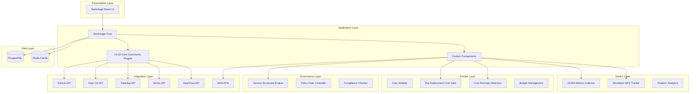

# Design Document: Internal Developer Platform

## Overview

本设计文档定义了基于 Backstage 构建的 Internal Developer Platform (IDP) 的技术架构，面向 50 人规模的 SaaS 开发公司。平台遵循"简化优先"原则，最大化使用成熟的社区插件（15-20 个核心插件），最小化自定义开发。

### 核心设计原则

1. **社区插件优先**: 最大化使用成熟的 Backstage 社区插件，避免重复造轮子
2. **最小化自定义开发**: 仅在高价值、无社区插件替代的情况下进行自定义开发
3. **简化架构**: 避免过度工程，专注于核心价值流
4. **2026 年架构模式**: 治理默认、FinOps 集成、服务成熟度驱动
5. **可扩展性**: 架构支持从 50 人扩展到 200+ 人
6. **开发者体验优先**: 减少认知负荷，提高 Time-to-Value

### 技术栈

- **Frontend**: React 18+ (Backstage UI Framework)
- **Backend**: Node.js 20+ (Backstage Backend Framework)
- **Database**: PostgreSQL 15+
- **Container Orchestration**: Kubernetes 1.28+ on AWS EKS
- **GitOps**: Argo CD 2.9+
- **Monitoring**: Datadog
- **Error Tracking**: Sentry
- **Cost Management**: OpenCost
- **CI/CD**: GitHub Actions
- **Authentication**: GitHub OAuth / Keycloak OIDC


## Architecture

### 高层架构

平台采用分层架构，每层职责清晰：


```mermaid
graph TB
    subgraph "Presentation Layer"
        UI[Backstage React UI]
    end
    
    subgraph "Application Layer"
        Core[Backstage Core]
        Plugins[15-20 Core Community Plugins]
        Custom[Custom Components]
    end
    
    subgraph "Integration Layer"
        GitHub[GitHub API]
        ArgoCD[Argo CD API]
        Datadog[Datadog API]
        Sentry[Sentry API]
        OpenCost[OpenCost API]
        AWS[AWS APIs]
    end
    
    subgraph "Governance Layer"
        Scorecard[Service Scorecard Engine]
        PolicyGate[Policy Gate Controller]
        Compliance[Compliance Checker]
    end
    
    subgraph "FinOps Layer"
        CostVis[Cost Visibility]
        CostGate[Pre-Deployment Cost Gate]
        CostAnomaly[Cost Anomaly Detection]
        BudgetMgmt[Budget Management]
    end
    
    subgraph "DevEx Layer"
        DORA[DORA Metrics Collector]
        NPS[Developer NPS Tracker]
        Analytics[Platform Analytics]
    end
    
    subgraph "Data Layer"
        DB[(PostgreSQL)]
        Cache[(Redis Cache)]
    end
    
    UI --> Core
    Core --> Plugins
    Core --> Custom
    Plugins --> GitHub
    Plugins --> ArgoCD
    Plugins --> Datadog
    Plugins --> Sentry
    Plugins --> OpenCost
    Custom --> AWS
    Custom --> Scorecard
    Custom --> CostGate
    Custom --> CostAnomaly
    Custom --> DORA
    Custom --> NPS
    Core --> DB
    Core --> Cache
```

### 架构层详解

#### 1. Presentation Layer (展示层)
- 基于 Backstage React UI Framework
- 响应式设计，支持桌面和移动端
- 统一的导航和搜索体验
- 可定制的仪表板和视图

#### 2. Application Layer (应用层)
- **Backstage Core**: 提供核心框架能力（插件系统、路由、认证）
- **Community Plugins**: 15-20 个精选社区插件（详见下文）
- **Custom Components**: 最小化自定义开发（FinOps 门控、NPS 收集、成熟度规则）

#### 3. Integration Layer (集成层)
- 与外部系统的 API 集成
- 统一的错误处理和重试机制
- API 速率限制和缓存策略
- 遵守外部系统的 RBAC 权限

#### 4. Governance Layer (治理层)
- 服务成熟度评分引擎
- 生产就绪门控控制器
- 合规性自动化检查
- 策略即代码 (Policy as Code)

#### 5. FinOps Layer (FinOps 层)
- 成本可见性和归因
- 预部署成本估算和门控
- 成本异常检测和告警
- 预算管理和跟踪

#### 6. DevEx Layer (开发者体验层)
- DORA 指标收集和分析
- 开发者 NPS 跟踪
- 平台采用率分析
- 瓶颈识别和量化

#### 7. Data Layer (数据层)
- PostgreSQL: 持久化存储（服务元数据、用户数据、指标）
- Redis: 缓存层（API 响应、会话、临时数据）


### 核心社区插件（精简到 15-20 个）

#### 必需插件（核心功能）
1. **@backstage/plugin-catalog**: Service Catalog 核心
2. **@backstage/plugin-scaffolder**: Golden Path Templates
3. **@backstage/plugin-techdocs**: 文档即代码
4. **@backstage/plugin-kubernetes**: Kubernetes 集成
5. **@backstage/plugin-search**: 统一搜索

#### 监控和可观测性（3 个）
6. **@roadie/backstage-plugin-datadog**: Datadog 监控仪表板集成
7. **@spotify/backstage-plugin-sentry**: Sentry 错误跟踪集成
8. **@k-phoen/backstage-plugin-grafana**: Grafana 仪表板（可选）

#### CI/CD 和 GitOps（2 个）
9. **@spotify/backstage-plugin-github-actions**: GitHub Actions CI/CD 可见性
10. **@roadie/backstage-plugin-argo-cd**: Argo CD GitOps 部署状态

#### FinOps 和成本管理（2 个）
11. **@mattray/backstage-plugin-opencost**: Kubernetes 成本可见性
12. **@spotify/backstage-plugin-cost-insights**: 云成本管理（可选）

#### DevEx 和指标（2 个）
13. **@devoteam/backstage-plugin-opendora**: DORA 指标跟踪
14. **@backstage-community/plugin-tech-insights**: 服务评分卡和技术洞察

#### 安全和合规性（1 个）
15. **@roadie/backstage-plugin-security-insights**: 漏洞管理和安全扫描

#### AI 辅助（可选，2 个）
16. **@roadie/backstage-plugin-ai-assistant**: AI 辅助搜索和问答
17. **@veecode/backstage-plugin-kubernetes-gpt-analyzer**: AI 驱动的 Kubernetes 故障排除

#### 开发者工具（可选，2 个）
18. **@drodil/backstage-plugin-toolbox**: 开发者实用工具集
19. **@roadie/backstage-plugin-github-pull-requests**: GitHub PR 管理

### 移除的插件（从原 40+ 减少）

以下插件已从原始设计中移除，原因是低使用率、重复功能或高维护成本：

- **Prometheus Plugin**: 已由 Datadog 替代
- **Lighthouse Plugin**: 性能测试可在 CI/CD 中完成
- **Jaeger Plugin**: 分布式追踪已由 Datadog APM 提供
- **Vault Plugin**: 密钥管理通过 AWS Secrets Manager 处理
- **Nexus/Artifactory Plugin**: 制品管理已由 GitHub Packages 提供
- **Terraform Plugin**: IaC 管理通过 GitHub Actions 处理
- **Kiali Plugin**: 服务网格可视化不是当前需求
- **Kubelog Plugin**: 日志查看已由 Datadog 提供
- **n8n Plugin**: 工作流自动化需求通过 GitHub Actions 满足
- **Feishu Plugin**: 一次性迁移任务，不是平台核心功能
- **Custom AIOps ML Models**: 过于复杂，ROI 不明确


## Components and Interfaces

### 1. Service Catalog API (Requirement 1)

**职责**: 管理服务注册、发现和元数据

**接口**:

```typescript
interface ServiceCatalogAPI {
  // 获取所有服务
  listServices(filters?: ServiceFilters): Promise<Service[]>;
  
  // 获取单个服务详情
  getService(serviceId: string): Promise<ServiceDetail>;
  
  // 获取服务依赖图
  getServiceDependencies(serviceId: string): Promise<DependencyGraph>;
  
  // 注册新服务
  registerService(catalogInfo: CatalogInfo): Promise<Service>;
  
  // 更新服务元数据
  updateService(serviceId: string, updates: Partial<Service>): Promise<Service>;
  
  // 自动发现服务（从 GitHub 扫描 catalog-info.yaml）
  discoverServices(): Promise<DiscoveryResult>;
}

interface Service {
  id: string;
  name: string;
  description: string;
  owner: string;
  team: string;
  repositoryUrl: string;
  deploymentStatus: DeploymentStatus;
  maturityScore: number;
  tags: string[];
  dependencies: string[];
  createdAt: Date;
  updatedAt: Date;
}

interface ServiceFilters {
  owner?: string;
  team?: string;
  tags?: string[];
  minMaturityScore?: number;
}
```

**实现**: 使用 @backstage/plugin-catalog 社区插件

### 2. Scaffolder API (Requirement 2)

**职责**: 管理 Golden Path 模板和项目创建

**接口**:

```typescript
interface ScaffolderAPI {
  // 获取所有可用模板
  listTemplates(): Promise<Template[]>;
  
  // 获取模板详情
  getTemplate(templateId: string): Promise<TemplateDetail>;
  
  // 使用模板创建新项目
  createProject(request: ProjectCreationRequest): Promise<ProjectCreationResult>;
  
  // 获取项目创建状态
  getCreationStatus(taskId: string): Promise<CreationStatus>;
}

interface Template {
  id: string;
  name: string;
  description: string;
  type: 'java' | 'go' | 'react' | 'react-native';
  parameters: TemplateParameter[];
  includes: string[]; // Dockerfile, CI/CD, Helm charts, etc.
}

interface ProjectCreationRequest {
  templateId: string;
  projectName: string;
  description: string;
  owner: string;
  team: string;
  parameters: Record<string, any>;
}

interface ProjectCreationResult {
  taskId: string;
  repositoryUrl: string;
  serviceId: string;
  status: 'pending' | 'in_progress' | 'completed' | 'failed';
}
```

**实现**: 使用 @backstage/plugin-scaffolder 社区插件


### 3. Deployment Status API (Requirement 3)

**职责**: 提供跨环境的部署状态和 GitOps 操作

**接口**:

```typescript
interface DeploymentStatusAPI {
  // 获取服务的部署状态（所有环境）
  getDeploymentStatus(serviceId: string): Promise<DeploymentStatus>;
  
  // 获取特定环境的部署状态
  getEnvironmentStatus(serviceId: string, environment: Environment): Promise<EnvironmentStatus>;
  
  // 触发手动同步
  triggerSync(serviceId: string, environment: Environment): Promise<SyncResult>;
  
  // 获取部署历史
  getDeploymentHistory(serviceId: string, limit?: number): Promise<Deployment[]>;
}

interface DeploymentStatus {
  serviceId: string;
  environments: {
    development: EnvironmentStatus;
    staging: EnvironmentStatus;
    production: EnvironmentStatus;
  };
  lastDeployment: Deployment;
}

interface EnvironmentStatus {
  environment: Environment;
  syncStatus: 'Synced' | 'OutOfSync' | 'Unknown';
  health: 'Healthy' | 'Progressing' | 'Degraded' | 'Suspended';
  revision: string;
  lastSyncTime: Date;
  errorMessage?: string;
  logUrl?: string;
}

type Environment = 'development' | 'staging' | 'production';
```

**实现**: 使用 @roadie/backstage-plugin-argo-cd 社区插件

### 4. Observability API (Requirement 4)

**职责**: 集成监控、日志和错误跟踪

**接口**:

```typescript
interface ObservabilityAPI {
  // 获取服务的 Datadog 仪表板
  getDatadogDashboard(serviceId: string): Promise<DashboardEmbed>;
  
  // 获取最近的 Sentry 错误
  getRecentErrors(serviceId: string, limit?: number): Promise<SentryError[]>;
  
  // 获取日志查询链接
  getLogUrl(serviceId: string, filters?: LogFilters): Promise<string>;
  
  // 检查用户权限（遵守外部 RBAC）
  checkAccess(userId: string, serviceId: string): Promise<AccessPermissions>;
}

interface DashboardEmbed {
  embedUrl: string;
  dashboardId: string;
  timeRange: string;
}

interface SentryError {
  id: string;
  title: string;
  message: string;
  count: number;
  firstSeen: Date;
  lastSeen: Date;
  status: 'unresolved' | 'resolved' | 'ignored';
  url: string;
}

interface AccessPermissions {
  canViewMetrics: boolean;
  canViewLogs: boolean;
  canViewErrors: boolean;
}
```

**实现**: 
- Datadog: @roadie/backstage-plugin-datadog
- Sentry: @spotify/backstage-plugin-sentry


### 5. FinOps API (Requirement 5)

**职责**: 成本可见性、预部署门控、异常检测

**接口**:

```typescript
interface FinOpsAPI {
  // 获取服务的成本数据
  getServiceCost(serviceId: string, timeRange: TimeRange): Promise<ServiceCost>;
  
  // 获取成本趋势
  getCostTrend(serviceId: string, timeRange: TimeRange): Promise<CostTrend>;
  
  // 预部署成本估算
  estimateDeploymentCost(request: DeploymentSpec): Promise<CostEstimate>;
  
  // 验证预算（预部署门控）
  validateBudget(serviceId: string, estimatedCost: number): Promise<BudgetValidation>;
  
  // 获取成本异常
  getCostAnomalies(serviceId: string): Promise<CostAnomaly[]>;
  
  // 获取成本效率指标
  getCostEfficiency(serviceId: string): Promise<CostEfficiency>;
}

interface ServiceCost {
  serviceId: string;
  totalCost: number;
  breakdown: {
    kubernetes: {
      cpu: number;
      memory: number;
      storage: number;
    };
    aws: {
      rds: number;
      s3: number;
      other: number;
    };
  };
  currency: string;
  period: TimeRange;
}

interface CostTrend {
  current: number;
  previous: number;
  changePercent: number;
  trend: 'increasing' | 'decreasing' | 'stable';
}

interface CostEstimate {
  estimatedMonthlyCost: number;
  breakdown: Record<string, number>;
  confidence: number; // 0-1
}

interface BudgetValidation {
  isValid: boolean;
  currentBudget: number;
  estimatedCost: number;
  remainingBudget: number;
  requiresApproval: boolean;
  approvalUrl?: string;
}

interface CostAnomaly {
  id: string;
  serviceId: string;
  detectedAt: Date;
  anomalyType: 'spike' | 'sustained_increase' | 'unusual_pattern';
  severity: 'low' | 'medium' | 'high';
  currentCost: number;
  expectedCost: number;
  deviation: number;
  recommendations: string[];
  notificationSent: boolean;
}

interface CostEfficiency {
  costPerRequest: number;
  costPerUser: number;
  utilizationRate: number;
  recommendations: string[];
}
```

**实现**: 
- 成本可见性: @mattray/backstage-plugin-opencost
- 预部署门控: 自定义开发
- 异常检测: 自定义开发（基于阈值，非 ML）


### 6. DORA Metrics API (Requirement 6)

**职责**: 收集和分析 DORA 指标和 DevEx 数据

**接口**:

```typescript
interface DORAMetricsAPI {
  // 获取团队的 DORA 指标
  getTeamMetrics(teamId: string, timeRange: TimeRange): Promise<DORAMetrics>;
  
  // 获取服务的 DORA 指标
  getServiceMetrics(serviceId: string, timeRange: TimeRange): Promise<DORAMetrics>;
  
  // 获取平台采用率数据
  getPlatformAdoption(timeRange: TimeRange): Promise<AdoptionMetrics>;
  
  // 获取开发者 NPS
  getDeveloperNPS(timeRange: TimeRange): Promise<NPSData>;
  
  // 提交 NPS 反馈
  submitNPSFeedback(feedback: NPSFeedback): Promise<void>;
  
  // 识别瓶颈
  identifyBottlenecks(timeRange: TimeRange): Promise<Bottleneck[]>;
}

interface DORAMetrics {
  deploymentFrequency: {
    value: number;
    unit: 'per_day' | 'per_week' | 'per_month';
    level: 'elite' | 'high' | 'medium' | 'low';
  };
  leadTimeForChanges: {
    value: number;
    unit: 'hours' | 'days';
    level: 'elite' | 'high' | 'medium' | 'low';
  };
  changeFailureRate: {
    value: number; // percentage
    level: 'elite' | 'high' | 'medium' | 'low';
  };
  timeToRestoreService: {
    value: number;
    unit: 'hours' | 'days';
    level: 'elite' | 'high' | 'medium' | 'low';
  };
  trend: 'improving' | 'stable' | 'declining';
}

interface AdoptionMetrics {
  dailyActiveUsers: number;
  weeklyActiveUsers: number;
  serviceCreationRate: number;
  featureUsage: Record<string, number>;
  topFeatures: string[];
}

interface NPSData {
  score: number; // -100 to 100
  responseCount: number;
  promoters: number;
  passives: number;
  detractors: number;
  trend: 'improving' | 'stable' | 'declining';
  topFeedback: string[];
}

interface NPSFeedback {
  userId: string;
  score: number; // 0-10
  comment?: string;
  category?: string;
}

interface Bottleneck {
  id: string;
  area: string;
  description: string;
  impact: 'high' | 'medium' | 'low';
  affectedUsers: number;
  averageDelay: number;
  recommendations: string[];
}
```

**实现**: 
- DORA 指标: @devoteam/backstage-plugin-opendora（扩展）
- NPS 收集: 自定义开发
- 平台分析: 自定义开发


### 7. Service Maturity API (Requirement 7)

**职责**: 评估服务成熟度和生产就绪状态

**接口**:

```typescript
interface ServiceMaturityAPI {
  // 获取服务成熟度评分卡
  getScorecard(serviceId: string): Promise<ServiceScorecard>;
  
  // 获取改进建议
  getImprovementSuggestions(serviceId: string): Promise<Suggestion[]>;
  
  // 验证生产就绪状态
  validateProductionReadiness(serviceId: string): Promise<ReadinessValidation>;
  
  // 获取团队成熟度基准
  getTeamBenchmark(teamId: string): Promise<TeamBenchmark>;
  
  // 获取成熟度趋势
  getMaturityTrend(serviceId: string, timeRange: TimeRange): Promise<MaturityTrend>;
}

interface ServiceScorecard {
  serviceId: string;
  overallScore: number; // 0-100
  categories: {
    documentation: CategoryScore;
    testing: CategoryScore;
    monitoring: CategoryScore;
    security: CategoryScore;
    costEfficiency: CategoryScore;
  };
  lastUpdated: Date;
}

interface CategoryScore {
  score: number; // 0-100
  weight: number;
  checks: Check[];
  status: 'passing' | 'warning' | 'failing';
}

interface Check {
  id: string;
  name: string;
  description: string;
  status: 'pass' | 'fail' | 'warning';
  required: boolean;
  value?: any;
  threshold?: any;
}

interface Suggestion {
  id: string;
  category: string;
  priority: 'high' | 'medium' | 'low';
  title: string;
  description: string;
  actionItems: string[];
  estimatedEffort: string;
  impact: string;
}

interface ReadinessValidation {
  isReady: boolean;
  minimumScore: number;
  currentScore: number;
  failingChecks: Check[];
  blockers: string[];
}

interface TeamBenchmark {
  teamId: string;
  averageScore: number;
  serviceCount: number;
  distribution: Record<string, number>;
  topServices: string[];
  bottomServices: string[];
}

interface MaturityTrend {
  dataPoints: Array<{
    date: Date;
    score: number;
  }>;
  improvement: number;
  trend: 'improving' | 'stable' | 'declining';
}
```

**实现**: 
- 基础评分卡: @backstage-community/plugin-tech-insights
- 自定义规则: 自定义开发


### 8. Developer Self-Service API (Requirement 8)

**职责**: 认证、授权、搜索和治理

**接口**:

```typescript
interface DeveloperSelfServiceAPI {
  // 用户认证
  authenticate(provider: 'github' | 'keycloak'): Promise<AuthResult>;
  
  // 获取用户权限
  getUserPermissions(userId: string): Promise<UserPermissions>;
  
  // 统一搜索
  search(query: string, filters?: SearchFilters): Promise<SearchResults>;
  
  // 检查访问权限
  checkAccess(userId: string, resource: string, action: string): Promise<boolean>;
}

interface AuthResult {
  userId: string;
  email: string;
  name: string;
  roles: string[];
  teams: string[];
  token: string;
}

interface UserPermissions {
  userId: string;
  roles: string[];
  teams: string[];
  permissions: Record<string, string[]>;
  lastUpdated: Date;
}

interface SearchFilters {
  types?: Array<'service' | 'documentation' | 'api' | 'team'>;
  tags?: string[];
  owner?: string;
}

interface SearchResults {
  query: string;
  total: number;
  results: SearchResult[];
}

interface SearchResult {
  type: 'service' | 'documentation' | 'api' | 'team';
  id: string;
  title: string;
  description: string;
  url: string;
  relevance: number;
  lastActivity: Date;
  tags: string[];
}
```

**实现**: 
- 认证: Backstage 内置 (GitHub OAuth / Keycloak OIDC)
- 搜索: @backstage/plugin-search
- RBAC: Backstage 内置权限系统


## Data Models

### Service Entity Model (增强)

```typescript
interface ServiceEntity {
  // 基础信息
  id: string;
  name: string;
  description: string;
  type: 'service' | 'library' | 'website' | 'documentation';
  
  // 所有权
  owner: string;
  team: string;
  
  // 仓库信息
  repositoryUrl: string;
  defaultBranch: string;
  
  // 部署信息
  deploymentStatus: {
    development: EnvironmentStatus;
    staging: EnvironmentStatus;
    production: EnvironmentStatus;
  };
  
  // 成熟度和质量
  maturityScore: number;
  productionReady: boolean;
  
  // 成本归因
  costAttribution: {
    monthlyCost: number;
    costCenter: string;
    budget: number;
    lastUpdated: Date;
  };
  
  // 依赖关系
  dependencies: string[];
  dependents: string[];
  
  // 元数据
  tags: string[];
  labels: Record<string, string>;
  annotations: Record<string, string>;
  
  // 时间戳
  createdAt: Date;
  updatedAt: Date;
  lastDeployedAt?: Date;
}
```

### Service Scorecard Model

```typescript
interface ServiceScorecardModel {
  id: string;
  serviceId: string;
  version: number;
  
  // 总体评分
  overallScore: number;
  
  // 分类评分
  categories: {
    documentation: {
      score: number;
      checks: {
        hasReadme: boolean;
        hasTechDocs: boolean;
        hasApiDocs: boolean;
        hasRunbook: boolean;
        documentationFreshness: number; // days since last update
      };
    };
    testing: {
      score: number;
      checks: {
        hasUnitTests: boolean;
        hasIntegrationTests: boolean;
        codeCoverage: number; // percentage
        testsPassing: boolean;
      };
    };
    monitoring: {
      score: number;
      checks: {
        hasMetrics: boolean;
        hasAlerts: boolean;
        hasLogging: boolean;
        hasDashboard: boolean;
        slosDefined: boolean;
      };
    };
    security: {
      score: number;
      checks: {
        hasSecurityScanning: boolean;
        vulnerabilityCount: number;
        highSeverityVulnerabilities: number;
        dependenciesUpToDate: boolean;
        secretsScanned: boolean;
      };
    };
    costEfficiency: {
      score: number;
      checks: {
        withinBudget: boolean;
        resourceUtilization: number; // percentage
        costTrend: 'improving' | 'stable' | 'worsening';
        hasRightSizing: boolean;
      };
    };
  };
  
  // 生产就绪状态
  productionReadiness: {
    isReady: boolean;
    minimumScore: number;
    failingChecks: string[];
  };
  
  // 时间戳
  calculatedAt: Date;
  expiresAt: Date;
}
```


### FinOps Cost Model

```typescript
interface FinOpsCostModel {
  id: string;
  serviceId: string;
  
  // 成本数据
  costs: {
    kubernetes: {
      cpu: number;
      memory: number;
      storage: number;
      total: number;
    };
    aws: {
      rds: number;
      s3: number;
      cloudfront: number;
      other: number;
      total: number;
    };
    total: number;
  };
  
  // 预算
  budget: {
    monthly: number;
    remaining: number;
    utilizationPercent: number;
  };
  
  // 趋势
  trend: {
    previousPeriod: number;
    changePercent: number;
    direction: 'increasing' | 'decreasing' | 'stable';
  };
  
  // 异常
  anomalies: Array<{
    id: string;
    detectedAt: Date;
    type: 'spike' | 'sustained_increase' | 'unusual_pattern';
    severity: 'low' | 'medium' | 'high';
    deviation: number;
    resolved: boolean;
  }>;
  
  // 效率指标
  efficiency: {
    costPerRequest: number;
    costPerUser: number;
    utilizationRate: number;
  };
  
  // 时间范围
  period: {
    start: Date;
    end: Date;
  };
  
  // 时间戳
  calculatedAt: Date;
}
```

### DORA Metrics Model

```typescript
interface DORAMetricsModel {
  id: string;
  entityId: string; // service or team
  entityType: 'service' | 'team';
  
  // DORA 四大指标
  metrics: {
    deploymentFrequency: {
      value: number;
      unit: 'per_day' | 'per_week' | 'per_month';
      level: 'elite' | 'high' | 'medium' | 'low';
      rawData: {
        deploymentCount: number;
        periodDays: number;
      };
    };
    
    leadTimeForChanges: {
      value: number;
      unit: 'hours' | 'days';
      level: 'elite' | 'high' | 'medium' | 'low';
      rawData: {
        averageLeadTime: number;
        medianLeadTime: number;
        p95LeadTime: number;
      };
    };
    
    changeFailureRate: {
      value: number; // percentage
      level: 'elite' | 'high' | 'medium' | 'low';
      rawData: {
        totalDeployments: number;
        failedDeployments: number;
      };
    };
    
    timeToRestoreService: {
      value: number;
      unit: 'hours' | 'days';
      level: 'elite' | 'high' | 'medium' | 'low';
      rawData: {
        averageMTTR: number;
        medianMTTR: number;
        incidentCount: number;
      };
    };
  };
  
  // 趋势
  trend: {
    direction: 'improving' | 'stable' | 'declining';
    changePercent: number;
  };
  
  // 时间范围
  period: {
    start: Date;
    end: Date;
  };
  
  // 时间戳
  calculatedAt: Date;
}
```


### Developer NPS Model

```typescript
interface DeveloperNPSModel {
  id: string;
  
  // NPS 评分
  nps: {
    score: number; // -100 to 100
    responseCount: number;
    promoters: number; // score 9-10
    passives: number; // score 7-8
    detractors: number; // score 0-6
  };
  
  // 反馈数据
  feedback: Array<{
    id: string;
    userId: string;
    score: number; // 0-10
    comment?: string;
    category?: string;
    sentiment?: 'positive' | 'neutral' | 'negative';
    submittedAt: Date;
  }>;
  
  // 趋势
  trend: {
    previousScore: number;
    change: number;
    direction: 'improving' | 'stable' | 'declining';
  };
  
  // 分类分析
  categoryBreakdown: Record<string, {
    averageScore: number;
    count: number;
    topIssues: string[];
  }>;
  
  // 时间范围
  period: {
    start: Date;
    end: Date;
  };
  
  // 时间戳
  calculatedAt: Date;
}
```


## Correctness Properties

*A property is a characteristic or behavior that should hold true across all valid executions of a system-essentially, a formal statement about what the system should do. Properties serve as the bridge between human-readable specifications and machine-verifiable correctness guarantees.*

### Property Reflection

在将验收标准转换为属性之前，我进行了属性反思以消除冗余：

**识别的冗余：**
1. AC 2.4 和 AC 8.5 都测试治理默认配置（安全扫描、合规性检查）- 合并为一个属性
2. AC 1.2 和 AC 1.4 都测试 5 分钟内的自动同步 - 可以合并为一个通用的"元数据同步"属性
3. AC 3.1、3.2、3.3 都测试部署状态显示 - 可以合并为一个综合属性
4. AC 4.1、4.2、4.3 都测试可观测性数据显示 - 可以合并为一个综合属性

**精简后的属性数量：** 从 38 个验收标准精简到约 18-20 个核心属性

### Requirement 1: Service Discovery and Catalog

#### Property 1: Service Catalog Completeness

*For any* registered service in the system, when a developer accesses the Service Catalog, the catalog SHALL display that service with complete metadata including owner, repository link, and deployment status.

**Validates: Requirements 1.1**

#### Property 2: Service Auto-Discovery and Metadata Sync

*For any* GitHub repository containing a catalog-info.yaml file, the Service Catalog SHALL discover and register the service within 5 minutes, and any subsequent metadata updates SHALL be reflected within 5 minutes.

**Validates: Requirements 1.2, 1.4**

#### Property 3: Service Detail Completeness

*For any* service in the catalog, when viewing service details, the system SHALL display both the service dependency graph and the current maturity score.

**Validates: Requirements 1.3**


### Requirement 2: Golden Path Templates

#### Property 4: Template Availability

*For any* developer initiating project creation, the system SHALL provide all four Golden Path templates (Java, Go, React, React Native) in the template list.

**Validates: Requirements 2.1**

#### Property 5: Generated Project Completeness

*For any* template and any valid project parameters, the generated GitHub repository SHALL contain all required files including Dockerfile, CI/CD configuration, Helm charts, catalog-info.yaml, security scanning configuration, cost budget configuration, and compliance check configuration.

**Validates: Requirements 2.2, 2.4, 8.5**

#### Property 6: Auto-Registration After Creation

*For any* successfully created project, the service SHALL automatically appear in the Service Catalog within the expected discovery time window.

**Validates: Requirements 2.3**

### Requirement 3: Deployment Status and GitOps

#### Property 7: Deployment Status Visibility

*For any* service, when viewing deployment status, the system SHALL display current status for all three environments (development, staging, production) including sync status, health information, error messages (if failed), and log links (if applicable).

**Validates: Requirements 3.1, 3.2, 3.3**

#### Property 8: Manual Sync Authorization

*For any* service and its owner, the owner SHALL have the ability to trigger manual sync operations for that service.

**Validates: Requirements 3.4**

### Requirement 4: Observability Integration

#### Property 9: Observability Data Completeness

*For any* service, when viewing observability data, the system SHALL display the service-filtered Datadog dashboard, recent Sentry errors with resolution status, and direct links to detailed logs in Datadog.

**Validates: Requirements 4.1, 4.2, 4.3**

#### Property 10: RBAC Permission Inheritance

*For any* user and service, the system SHALL enforce access permissions that match the user's permissions in the external Datadog and Sentry systems.

**Validates: Requirements 4.4**


### Requirement 5: FinOps and Cost Optimization

#### Property 11: Cost Data Completeness

*For any* service, when viewing cost data, the system SHALL display monthly Kubernetes costs (CPU, memory, storage breakdown), AWS resource costs, cost trends with percentage changes, and cost efficiency metrics (cost per request, cost per user).

**Validates: Requirements 5.1, 5.2, 5.5**

#### Property 12: Pre-Deployment Cost Gate

*For any* deployment request, if the estimated cost exceeds the service's remaining budget, the system SHALL block the deployment and require approval.

**Validates: Requirements 5.3**

#### Property 13: Cost Anomaly Detection and Alerting

*For any* detected cost anomaly, the system SHALL send an alert to the service owner and provide actionable recommendations.

**Validates: Requirements 5.4**

### Requirement 6: DORA Metrics and DevEx Analytics

#### Property 14: DORA Metrics Completeness

*For any* team or service, the system SHALL track and display all four DORA metrics (deployment frequency, lead time for changes, change failure rate, time to restore service) with their respective performance levels.

**Validates: Requirements 6.1**

#### Property 15: Platform Adoption Tracking

*For any* time range, the system SHALL display platform adoption metrics including daily active users, service creation rate, and feature usage patterns.

**Validates: Requirements 6.2**

#### Property 16: NPS Collection and Trend Analysis

*For any* submitted NPS feedback, the system SHALL calculate the overall NPS score (-100 to 100), categorize respondents (promoters, passives, detractors), and display feedback trends over time.

**Validates: Requirements 6.3**

#### Property 17: Bottleneck Identification

*For any* identified workflow bottleneck, the system SHALL quantify its impact (affected users, average delay) and provide recommendations.

**Validates: Requirements 6.4**


### Requirement 7: Service Maturity and Production Readiness

#### Property 18: Maturity Scorecard Completeness

*For any* service, the system SHALL calculate and display a maturity scorecard covering all five categories (documentation, testing, monitoring, security, cost efficiency) with individual scores and an overall score.

**Validates: Requirements 7.1**

#### Property 19: Improvement Suggestions Generation

*For any* service that fails one or more maturity checks, the system SHALL provide actionable improvement suggestions with priority, estimated effort, and expected impact.

**Validates: Requirements 7.2**

#### Property 20: Production Readiness Gate Enforcement

*For any* production deployment request, if the service's maturity score is below the minimum required threshold, the system SHALL block the deployment and list the failing checks.

**Validates: Requirements 7.3**

#### Property 21: Team Maturity Benchmarking

*For any* team, the system SHALL calculate and display maturity benchmarks including average score, service count, score distribution, and comparisons with other teams.

**Validates: Requirements 7.4**

#### Property 22: Maturity Trend Tracking

*For any* service, the system SHALL track maturity score changes over time and indicate whether the trend is improving, stable, or declining.

**Validates: Requirements 7.5**

### Requirement 8: Developer Self-Service with Governance

#### Property 23: Authentication Enforcement

*For any* unauthenticated user attempting to access the Developer Portal, the system SHALL redirect to the configured authentication provider (GitHub OAuth or Keycloak OIDC).

**Validates: Requirements 8.1**

#### Property 24: Permission Synchronization

*For any* user role change in the authentication system, the Developer Portal SHALL reflect the updated permissions within 5 minutes.

**Validates: Requirements 8.2**

#### Property 25: Unified Search Completeness

*For any* search query, the system SHALL return results from all entity types (services, documentation, APIs, teams) sorted by relevance and recent activity.

**Validates: Requirements 8.3**

#### Property 26: RBAC Enforcement for Sensitive Resources

*For any* attempt to access sensitive information, the system SHALL verify the user's role-based permissions and deny access if insufficient.

**Validates: Requirements 8.4**


## Error Handling

### 错误处理策略

平台采用分层错误处理策略，确保系统的健壮性和用户体验：

#### 1. 外部 API 集成错误

**场景**: GitHub、Argo CD、Datadog、Sentry、OpenCost、AWS API 调用失败

**处理策略**:
- **重试机制**: 使用指数退避策略，最多重试 3 次
- **超时控制**: 设置合理的超时时间（5-30 秒，根据 API 类型）
- **降级处理**: 
  - 使用缓存数据（如果可用）
  - 显示部分数据和错误提示
  - 提供手动刷新选项
- **错误日志**: 记录详细的错误信息用于调试
- **用户反馈**: 显示友好的错误消息，避免暴露技术细节

**示例**:
```typescript
try {
  const data = await fetchFromDatadog(serviceId);
  return data;
} catch (error) {
  logger.error('Datadog API error', { serviceId, error });
  
  // 尝试使用缓存
  const cachedData = await cache.get(`datadog:${serviceId}`);
  if (cachedData) {
    return { ...cachedData, fromCache: true };
  }
  
  // 返回降级响应
  throw new ServiceError('Unable to fetch monitoring data. Please try again later.', {
    code: 'DATADOG_UNAVAILABLE',
    retryable: true
  });
}
```

#### 2. 成本门控失败

**场景**: 预部署成本估算失败或超出预算

**处理策略**:
- **估算失败**: 
  - 记录错误并通知平台团队
  - 允许部署继续（fail-open），但记录警告
  - 显示"成本估算不可用"的提示
- **超出预算**:
  - 阻止部署（fail-closed）
  - 显示详细的成本对比和超出金额
  - 提供审批请求链接
  - 建议成本优化措施

**示例**:
```typescript
async function validateDeploymentCost(serviceId: string, spec: DeploymentSpec) {
  try {
    const estimate = await estimateCost(spec);
    const budget = await getBudget(serviceId);
    
    if (estimate.cost > budget.remaining) {
      return {
        allowed: false,
        reason: 'BUDGET_EXCEEDED',
        details: {
          estimated: estimate.cost,
          budget: budget.monthly,
          remaining: budget.remaining,
          approvalRequired: true
        }
      };
    }
    
    return { allowed: true };
  } catch (error) {
    logger.error('Cost validation error', { serviceId, error });
    
    // Fail-open for estimation errors
    return {
      allowed: true,
      warning: 'Cost estimation unavailable. Proceeding with deployment.'
    };
  }
}
```

#### 3. 服务评分卡计算错误

**场景**: 成熟度评分计算失败（数据源不可用、计算逻辑错误）

**处理策略**:
- **部分数据可用**: 计算可用类别的评分，标记不可用的类别
- **完全失败**: 使用上次成功计算的评分（如果存在）
- **首次计算失败**: 显示"评分计算中"状态
- **错误通知**: 通知平台团队进行调查

**示例**:
```typescript
async function calculateScorecard(serviceId: string): Promise<ServiceScorecard> {
  const results = await Promise.allSettled([
    calculateDocumentationScore(serviceId),
    calculateTestingScore(serviceId),
    calculateMonitoringScore(serviceId),
    calculateSecurityScore(serviceId),
    calculateCostEfficiencyScore(serviceId)
  ]);
  
  const categories = {};
  let failedCategories = [];
  
  results.forEach((result, index) => {
    const categoryName = CATEGORY_NAMES[index];
    if (result.status === 'fulfilled') {
      categories[categoryName] = result.value;
    } else {
      logger.error(`Scorecard calculation failed for ${categoryName}`, {
        serviceId,
        error: result.reason
      });
      failedCategories.push(categoryName);
      categories[categoryName] = { score: null, status: 'unavailable' };
    }
  });
  
  // Calculate overall score from available categories
  const availableScores = Object.values(categories)
    .filter(c => c.score !== null)
    .map(c => c.score);
  
  const overallScore = availableScores.length > 0
    ? availableScores.reduce((a, b) => a + b, 0) / availableScores.length
    : null;
  
  return {
    serviceId,
    overallScore,
    categories,
    warnings: failedCategories.length > 0
      ? [`Unable to calculate scores for: ${failedCategories.join(', ')}`]
      : []
  };
}
```

#### 4. DORA 指标计算错误

**场景**: 数据收集失败、计算逻辑错误

**处理策略**:
- **数据源不可用**: 使用可用的数据源计算部分指标
- **历史数据**: 显示上次成功计算的指标和时间戳
- **数据不足**: 显示"数据不足"提示和最小数据要求
- **错误恢复**: 自动重试计算（每小时）

#### 5. 认证和授权错误

**场景**: 认证失败、权限不足、会话过期

**处理策略**:
- **认证失败**: 重定向到登录页面，保存原始请求 URL
- **权限不足**: 显示 403 错误页面，说明所需权限
- **会话过期**: 自动刷新 token（如果可能），否则重新认证
- **RBAC 错误**: 记录权限检查失败，通知管理员

#### 6. 数据库错误

**场景**: 连接失败、查询超时、数据不一致

**处理策略**:
- **连接池管理**: 使用连接池，自动重连
- **查询超时**: 设置合理的超时时间，记录慢查询
- **事务回滚**: 确保数据一致性
- **只读降级**: 在数据库压力大时，限制写操作

### 错误监控和告警

所有错误都会被记录到 Sentry，并根据严重程度触发告警：

- **Critical**: 影响核心功能（认证、服务创建）- 立即通知
- **High**: 影响重要功能（成本门控、评分卡）- 15 分钟内通知
- **Medium**: 影响次要功能（某个集成失败）- 1 小时内通知
- **Low**: 不影响功能（缓存失效）- 每日汇总


## Testing Strategy

### 测试方法概述

平台采用双重测试策略，结合单元测试和基于属性的测试（Property-Based Testing, PBT），确保全面的测试覆盖：

- **单元测试**: 验证具体示例、边缘情况和错误条件
- **属性测试**: 验证跨所有输入的通用属性
- **集成测试**: 验证外部集成和端到端工作流
- **端到端测试**: 验证关键用户旅程

### 1. 单元测试策略

**测试框架**: Jest (Node.js/TypeScript)

**覆盖范围**:
- 核心业务逻辑（成本计算、评分卡计算、DORA 指标计算）
- API 端点（请求验证、响应格式）
- 数据模型（序列化、验证）
- 错误处理（各种失败场景）
- 权限检查（RBAC 逻辑）

**示例**:
```typescript
describe('Cost Estimation', () => {
  it('should calculate Kubernetes cost correctly', () => {
    const spec = {
      cpu: '2',
      memory: '4Gi',
      replicas: 3
    };
    const cost = estimateKubernetesCost(spec);
    expect(cost).toBeCloseTo(150.5, 2);
  });
  
  it('should handle invalid resource specifications', () => {
    const spec = { cpu: 'invalid', memory: '4Gi' };
    expect(() => estimateKubernetesCost(spec)).toThrow('Invalid CPU specification');
  });
  
  it('should return zero cost for empty spec', () => {
    const cost = estimateKubernetesCost({});
    expect(cost).toBe(0);
  });
});
```

**单元测试平衡原则**:
- 专注于具体示例和边缘情况
- 避免过多的单元测试 - 属性测试已覆盖大量输入
- 优先测试复杂的业务逻辑和错误处理
- 每个核心函数至少 3-5 个测试用例

### 2. 基于属性的测试策略

**测试框架**: fast-check (JavaScript/TypeScript 的 PBT 库)

**配置**:
- 每个属性测试最少 100 次迭代
- 使用种子值确保可重现性
- 自动生成测试数据（服务、用户、成本数据等）

**标签格式**:
每个属性测试必须包含注释，引用设计文档中的属性：

```typescript
/**
 * Feature: internal-developer-platform, Property 1: Service Catalog Completeness
 * 
 * For any registered service in the system, when a developer accesses the 
 * Service Catalog, the catalog SHALL display that service with complete 
 * metadata including owner, repository link, and deployment status.
 */
```

**属性测试示例**:

```typescript
import fc from 'fast-check';

/**
 * Feature: internal-developer-platform, Property 11: Cost Data Completeness
 */
describe('Property 11: Cost Data Completeness', () => {
  it('should display complete cost data for any service', () => {
    fc.assert(
      fc.property(
        fc.record({
          serviceId: fc.uuid(),
          kubernetesCost: fc.record({
            cpu: fc.float({ min: 0, max: 10000 }),
            memory: fc.float({ min: 0, max: 10000 }),
            storage: fc.float({ min: 0, max: 10000 })
          }),
          awsCost: fc.record({
            rds: fc.float({ min: 0, max: 10000 }),
            s3: fc.float({ min: 0, max: 10000 }),
            other: fc.float({ min: 0, max: 10000 })
          })
        }),
        async (costData) => {
          const result = await getCostData(costData.serviceId, costData);
          
          // Verify all required fields are present
          expect(result).toHaveProperty('kubernetesCost');
          expect(result.kubernetesCost).toHaveProperty('cpu');
          expect(result.kubernetesCost).toHaveProperty('memory');
          expect(result.kubernetesCost).toHaveProperty('storage');
          
          expect(result).toHaveProperty('awsCost');
          expect(result.awsCost).toHaveProperty('rds');
          expect(result.awsCost).toHaveProperty('s3');
          
          expect(result).toHaveProperty('trend');
          expect(result).toHaveProperty('efficiency');
        }
      ),
      { numRuns: 100 }
    );
  });
});

/**
 * Feature: internal-developer-platform, Property 12: Pre-Deployment Cost Gate
 */
describe('Property 12: Pre-Deployment Cost Gate', () => {
  it('should block deployment when estimated cost exceeds budget', () => {
    fc.assert(
      fc.property(
        fc.record({
          serviceId: fc.uuid(),
          budget: fc.float({ min: 100, max: 10000 }),
          estimatedCost: fc.float({ min: 100, max: 20000 })
        }),
        async ({ serviceId, budget, estimatedCost }) => {
          const validation = await validateBudget(serviceId, estimatedCost, budget);
          
          if (estimatedCost > budget) {
            expect(validation.isValid).toBe(false);
            expect(validation.requiresApproval).toBe(true);
            expect(validation.approvalUrl).toBeDefined();
          } else {
            expect(validation.isValid).toBe(true);
            expect(validation.requiresApproval).toBe(false);
          }
        }
      ),
      { numRuns: 100 }
    );
  });
});

/**
 * Feature: internal-developer-platform, Property 18: Maturity Scorecard Completeness
 */
describe('Property 18: Maturity Scorecard Completeness', () => {
  it('should calculate all five category scores for any service', () => {
    fc.assert(
      fc.property(
        fc.record({
          serviceId: fc.uuid(),
          hasReadme: fc.boolean(),
          hasTechDocs: fc.boolean(),
          codeCoverage: fc.float({ min: 0, max: 100 }),
          hasMetrics: fc.boolean(),
          vulnerabilityCount: fc.nat({ max: 50 }),
          withinBudget: fc.boolean()
        }),
        async (serviceData) => {
          const scorecard = await calculateScorecard(serviceData.serviceId, serviceData);
          
          // Verify all five categories are present
          expect(scorecard.categories).toHaveProperty('documentation');
          expect(scorecard.categories).toHaveProperty('testing');
          expect(scorecard.categories).toHaveProperty('monitoring');
          expect(scorecard.categories).toHaveProperty('security');
          expect(scorecard.categories).toHaveProperty('costEfficiency');
          
          // Verify overall score is calculated
          expect(scorecard.overallScore).toBeGreaterThanOrEqual(0);
          expect(scorecard.overallScore).toBeLessThanOrEqual(100);
          
          // Verify each category has a score
          Object.values(scorecard.categories).forEach(category => {
            expect(category.score).toBeGreaterThanOrEqual(0);
            expect(category.score).toBeLessThanOrEqual(100);
          });
        }
      ),
      { numRuns: 100 }
    );
  });
});
```


### 3. 集成测试策略

**测试框架**: Jest + Supertest (API 测试)

**覆盖范围**:
- 外部 API 集成（GitHub, Argo CD, Datadog, Sentry, OpenCost）
- 数据库操作（CRUD 操作、事务）
- 认证和授权流程
- 缓存机制

**测试环境**:
- 使用 Docker Compose 启动测试环境
- Mock 外部 API（使用 nock 或 MSW）
- 使用测试数据库（PostgreSQL in Docker）

**示例**:
```typescript
describe('GitHub Integration', () => {
  beforeAll(async () => {
    // Setup mock GitHub API
    nock('https://api.github.com')
      .get('/repos/test-org/test-repo/contents/catalog-info.yaml')
      .reply(200, mockCatalogInfo);
  });
  
  it('should discover services from GitHub repositories', async () => {
    const result = await discoverServices();
    
    expect(result.discovered).toBeGreaterThan(0);
    expect(result.services).toContainEqual(
      expect.objectContaining({
        name: 'test-service',
        repositoryUrl: 'https://github.com/test-org/test-repo'
      })
    );
  });
});

describe('Cost Gate Integration', () => {
  it('should integrate with OpenCost and budget system', async () => {
    const deploymentSpec = {
      cpu: '2',
      memory: '4Gi',
      replicas: 3
    };
    
    const validation = await validateDeploymentCost('test-service', deploymentSpec);
    
    expect(validation).toHaveProperty('allowed');
    expect(validation).toHaveProperty('estimatedCost');
    expect(validation).toHaveProperty('budget');
  });
});
```

### 4. 端到端测试策略

**测试框架**: Playwright (浏览器自动化)

**覆盖范围**:
- 关键用户旅程（服务创建、部署查看、成本查看）
- 认证流程
- 搜索功能
- 响应式设计

**测试场景**:

1. **服务创建旅程**:
   - 登录 → 选择模板 → 填写参数 → 创建服务 → 验证服务出现在 Catalog

2. **成本查看旅程**:
   - 登录 → 搜索服务 → 查看成本数据 → 验证成本细分显示

3. **部署状态旅程**:
   - 登录 → 查看服务 → 检查部署状态 → 触发手动同步

**示例**:
```typescript
import { test, expect } from '@playwright/test';

test('Service creation journey', async ({ page }) => {
  // Login
  await page.goto('/');
  await page.click('text=Sign in with GitHub');
  // ... OAuth flow ...
  
  // Navigate to create service
  await page.click('text=Create');
  await page.click('text=Create Component');
  
  // Select template
  await page.click('text=Go Service');
  await page.click('text=Next');
  
  // Fill parameters
  await page.fill('[name="name"]', 'test-service');
  await page.fill('[name="description"]', 'Test service');
  await page.click('text=Create');
  
  // Wait for creation
  await page.waitForSelector('text=Service created successfully');
  
  // Verify service appears in catalog
  await page.goto('/catalog');
  await expect(page.locator('text=test-service')).toBeVisible();
});
```

### 5. 性能测试

**测试工具**: k6 (负载测试)

**测试场景**:
- API 端点响应时间（< 500ms for p95）
- 并发用户负载（50 用户同时访问）
- 数据库查询性能
- 缓存命中率

**示例**:
```javascript
import http from 'k6/http';
import { check, sleep } from 'k6';

export let options = {
  stages: [
    { duration: '2m', target: 10 },
    { duration: '5m', target: 50 },
    { duration: '2m', target: 0 }
  ],
  thresholds: {
    http_req_duration: ['p(95)<500']
  }
};

export default function() {
  let response = http.get('http://localhost:7007/api/catalog/entities');
  
  check(response, {
    'status is 200': (r) => r.status === 200,
    'response time < 500ms': (r) => r.timings.duration < 500
  });
  
  sleep(1);
}
```

### 测试覆盖率目标

- **单元测试**: > 80% 代码覆盖率
- **属性测试**: 26 个核心属性，每个 100+ 次迭代
- **集成测试**: 所有外部集成和关键工作流
- **端到端测试**: 5-10 个关键用户旅程
- **性能测试**: 所有公共 API 端点

### CI/CD 集成

所有测试在 GitHub Actions 中自动运行：

```yaml
name: Test

on: [push, pull_request]

jobs:
  test:
    runs-on: ubuntu-latest
    steps:
      - uses: actions/checkout@v3
      
      - name: Setup Node.js
        uses: actions/setup-node@v3
        with:
          node-version: '20'
      
      - name: Install dependencies
        run: npm ci
      
      - name: Run unit tests
        run: npm run test:unit
      
      - name: Run property tests
        run: npm run test:property
      
      - name: Run integration tests
        run: npm run test:integration
      
      - name: Upload coverage
        uses: codecov/codecov-action@v3
```

### 测试数据管理

- **测试数据生成**: 使用 faker.js 和 fast-check 生成随机测试数据
- **测试数据隔离**: 每个测试使用独立的数据库事务，测试后回滚
- **Mock 数据**: 使用 fixtures 文件管理常用的 mock 数据
- **敏感数据**: 测试中不使用真实的生产数据


## Implementation Notes

### 自定义开发优先级

基于"最小化自定义开发"原则，以下是自定义组件的优先级：

#### 高优先级（必须实现）

1. **FinOps 预部署成本门控** (Requirement 5, AC 3)
   - 成本估算引擎
   - 预算验证逻辑
   - 审批工作流集成
   - 实现复杂度: 中等
   - 业务价值: 高

2. **服务成熟度评分卡自定义规则** (Requirement 7)
   - 扩展 @backstage-community/plugin-tech-insights
   - 自定义评分规则和权重
   - 生产就绪门控逻辑
   - 实现复杂度: 中等
   - 业务价值: 高

#### 中优先级（应该实现）

3. **成本异常检测与告警** (Requirement 5, AC 4)
   - 基于阈值的异常检测（非 ML）
   - 告警引擎（Slack/Email）
   - 推荐操作生成
   - 实现复杂度: 中等
   - 业务价值: 中等

4. **开发者 NPS 收集与分析** (Requirement 6, AC 3)
   - NPS 调查 UI 组件
   - 反馈存储和分析
   - 趋势可视化
   - 实现复杂度: 低
   - 业务价值: 中等

5. **DORA 指标增强** (Requirement 6, AC 1)
   - 扩展 @devoteam/backstage-plugin-opendora
   - 从 Argo CD 和 GitHub 收集数据
   - 团队和服务级别仪表板
   - 实现复杂度: 中等
   - 业务价值: 中等

#### 低优先级（可选）

6. **平台采用率分析** (Requirement 6, AC 2)
   - 用户活动跟踪
   - 功能使用统计
   - 可视化仪表板
   - 实现复杂度: 低
   - 业务价值: 低

### 技术债务和未来改进

#### 已知限制

1. **成本估算准确性**: 初始版本使用简化的成本模型，可能与实际成本有 10-20% 偏差
2. **成本异常检测**: 使用基于阈值的简单算法，可能产生误报
3. **DORA 指标计算**: 依赖于 Git 和 Argo CD 数据的完整性
4. **权限同步延迟**: 5 分钟的同步窗口可能在某些场景下不够及时

#### 未来改进方向

1. **成本优化建议**: 使用 ML 模型提供更智能的成本优化建议
2. **预测性告警**: 基于历史数据预测潜在问题
3. **自动化修复**: 某些常见问题的自动修复（如资源右调整）
4. **多云支持**: 扩展到 GCP、Azure 等其他云提供商
5. **高级分析**: 更深入的开发者生产力分析和瓶颈识别

### 安全考虑

1. **认证和授权**:
   - 使用 OAuth 2.0 / OIDC 标准
   - 实施最小权限原则
   - 定期审计权限配置

2. **数据保护**:
   - 敏感数据加密（静态和传输中）
   - 遵守 GDPR 和数据隐私要求
   - 定期备份和灾难恢复计划

3. **API 安全**:
   - 速率限制防止滥用
   - API 密钥轮换策略
   - 审计日志记录所有敏感操作

4. **依赖管理**:
   - 定期更新依赖项
   - 自动化漏洞扫描
   - 供应链安全（SBOM）

### 可扩展性考虑

1. **水平扩展**:
   - Backstage 后端支持多实例部署
   - 使用 Redis 作为共享缓存
   - 数据库连接池管理

2. **性能优化**:
   - API 响应缓存（5-15 分钟 TTL）
   - 数据库查询优化和索引
   - 异步处理长时间运行的任务

3. **监控和可观测性**:
   - 应用性能监控（Datadog APM）
   - 错误跟踪（Sentry）
   - 日志聚合和分析
   - 自定义指标和告警

### 部署策略

1. **环境**:
   - Development: 开发和测试
   - Staging: 预生产验证
   - Production: 生产环境

2. **部署流程**:
   - GitOps 使用 Argo CD
   - 蓝绿部署或金丝雀发布
   - 自动化回滚机制

3. **配置管理**:
   - 使用 Helm Charts
   - 环境特定的 values 文件
   - 密钥管理使用 AWS Secrets Manager

### 文档要求

1. **用户文档**:
   - 快速入门指南
   - 功能使用教程
   - 常见问题解答

2. **开发者文档**:
   - 架构概述
   - API 文档（OpenAPI/Swagger）
   - 贡献指南

3. **运维文档**:
   - 部署指南
   - 故障排查手册
   - 监控和告警配置

## Summary

本设计文档定义了基于 Backstage 的 Internal Developer Platform 的完整技术架构，遵循"简化优先"和"社区插件优先"原则。

### 核心设计决策

1. **精简插件集**: 从 40+ 个插件精简到 15-20 个核心插件，专注于高价值功能
2. **最小化自定义开发**: 仅在 5 个高价值领域进行自定义开发（FinOps 门控、成熟度评分、成本异常检测、NPS 收集、DORA 增强）
3. **2026 年架构模式**: 治理默认、FinOps 集成、服务成熟度驱动、DORA 指标标准化
4. **双重测试策略**: 结合单元测试和属性测试，确保全面覆盖

### 关键能力

- **服务发现和目录**: 自动发现、依赖可视化、成熟度评分
- **Golden Path 模板**: 标准化项目创建，治理默认
- **部署状态**: 跨环境可见性，GitOps 集成
- **可观测性**: 统一的监控、日志、错误跟踪
- **FinOps**: 成本可见性、预部署门控、异常检测
- **DevEx 分析**: DORA 指标、NPS 跟踪、瓶颈识别
- **服务成熟度**: 评分卡、生产就绪门控、改进建议
- **自助服务**: 认证、授权、搜索、治理

### 成功指标

- Time-to-Value < 4 小时
- Developer NPS > 8.0
- DORA 指标达到 Elite 级别
- 成本异常检测率 > 90%
- 服务成熟度评分 > 70

### 下一步

1. 审查和批准设计文档
2. 创建详细的实现任务列表
3. 优先级排序和迭代计划
4. 开始实现高优先级自定义组件
5. 配置和集成社区插件

