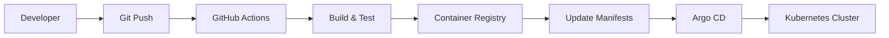

# Deployment Guide

This guide covers deploying services created with the Internal Developer Platform.

## Deployment Overview

The platform uses GitOps principles with Argo CD for automated deployments across multiple environments.

### Deployment Flow



## Environments

### Development
- **Purpose**: Feature development and testing
- **Deployment**: Automatic on merge to `develop` branch
- **Resources**: Shared development cluster
- **Access**: All developers

### Staging
- **Purpose**: Integration testing and QA
- **Deployment**: Automatic on merge to `main` branch
- **Resources**: Dedicated staging cluster
- **Access**: QA team and developers

### Production
- **Purpose**: Live customer traffic
- **Deployment**: Manual approval required
- **Resources**: Production cluster with HA
- **Access**: Platform team and on-call engineers

## Deployment Process

### Automatic Deployments

1. **Code Changes**
   ```bash
   git checkout -b feature/new-feature
   # Make changes
   git commit -m "feat: add new feature"
   git push origin feature/new-feature
   ```

2. **Pull Request**
   - Create PR to `main` branch
   - Automated tests run
   - Code review required
   - Merge triggers deployment

3. **CI/CD Pipeline**
   ```yaml
   # .github/workflows/deploy.yml
   name: Deploy
   on:
     push:
       branches: [main]
   
   jobs:
     deploy:
       runs-on: ubuntu-latest
       steps:
         - name: Build and push image
           run: |
             docker build -t $IMAGE_TAG .
             docker push $IMAGE_TAG
         
         - name: Update manifests
           run: |
             yq e '.spec.template.spec.containers[0].image = "$IMAGE_TAG"' \
               -i k8s/deployment.yaml
         
         - name: Commit updated manifests
           run: |
             git add k8s/
             git commit -m "chore: update image to $IMAGE_TAG"
             git push
   ```

### Manual Deployments

For production deployments:

1. **Create Release**
   ```bash
   git tag -a v1.2.3 -m "Release v1.2.3"
   git push origin v1.2.3
   ```

2. **Approve in Argo CD**
   - Navigate to Argo CD UI
   - Find your application
   - Click "Sync" to deploy

3. **Monitor Deployment**
   - Check deployment status in Argo CD
   - Monitor metrics in Datadog
   - Verify health checks pass

## Configuration Management

### Environment Variables

Use Kubernetes ConfigMaps and Secrets:

```yaml
# k8s/configmap.yaml
apiVersion: v1
kind: ConfigMap
metadata:
  name: my-service-config
data:
  DATABASE_URL: "postgresql://..."
  LOG_LEVEL: "info"
  FEATURE_FLAGS: "feature1=true,feature2=false"
```

```yaml
# k8s/secret.yaml
apiVersion: v1
kind: Secret
metadata:
  name: my-service-secrets
type: Opaque
data:
  API_KEY: <base64-encoded-value>
  DATABASE_PASSWORD: <base64-encoded-value>
```

### Application Configuration

```yaml
# k8s/deployment.yaml
spec:
  template:
    spec:
      containers:
      - name: my-service
        image: my-service:latest
        envFrom:
        - configMapRef:
            name: my-service-config
        - secretRef:
            name: my-service-secrets
        env:
        - name: ENVIRONMENT
          value: "production"
```

## Health Checks

### Liveness Probe
Checks if the application is running:

```yaml
livenessProbe:
  httpGet:
    path: /health
    port: 8080
  initialDelaySeconds: 30
  periodSeconds: 10
  timeoutSeconds: 5
  failureThreshold: 3
```

### Readiness Probe
Checks if the application is ready to serve traffic:

```yaml
readinessProbe:
  httpGet:
    path: /ready
    port: 8080
  initialDelaySeconds: 5
  periodSeconds: 5
  timeoutSeconds: 3
  failureThreshold: 3
```

### Health Check Implementation

```typescript
// Health check endpoint
app.get('/health', (req, res) => {
  res.status(200).json({
    status: 'healthy',
    timestamp: new Date().toISOString(),
    uptime: process.uptime(),
    version: process.env.APP_VERSION
  });
});

// Readiness check endpoint
app.get('/ready', async (req, res) => {
  try {
    // Check database connection
    await database.ping();
    
    // Check external dependencies
    await externalService.healthCheck();
    
    res.status(200).json({
      status: 'ready',
      checks: {
        database: 'ok',
        externalService: 'ok'
      }
    });
  } catch (error) {
    res.status(503).json({
      status: 'not ready',
      error: error.message
    });
  }
});
```

## Monitoring Deployment

### Deployment Metrics

Monitor these key metrics during deployments:

- **Error Rate**: Should remain low during deployment
- **Response Time**: Should not increase significantly
- **Throughput**: Should maintain expected levels
- **Resource Usage**: CPU and memory consumption

### Rollback Procedures

If issues are detected:

1. **Automatic Rollback**
   ```bash
   # Argo CD automatic rollback on health check failure
   kubectl rollout undo deployment/my-service
   ```

2. **Manual Rollback**
   ```bash
   # Rollback to previous version
   kubectl rollout undo deployment/my-service
   
   # Rollback to specific revision
   kubectl rollout undo deployment/my-service --to-revision=2
   ```

3. **Emergency Rollback**
   ```bash
   # Scale down to zero
   kubectl scale deployment my-service --replicas=0
   
   # Restore previous image
   kubectl set image deployment/my-service \
     my-service=my-service:previous-tag
   
   # Scale back up
   kubectl scale deployment my-service --replicas=3
   ```

## Troubleshooting

### Common Issues

#### Pod Startup Failures
```bash
# Check pod status
kubectl get pods -l app=my-service

# Check pod logs
kubectl logs -l app=my-service --tail=100

# Describe pod for events
kubectl describe pod <pod-name>
```

#### Image Pull Errors
```bash
# Check image exists
docker pull my-service:latest

# Verify image registry credentials
kubectl get secret regcred -o yaml
```

#### Configuration Issues
```bash
# Check ConfigMap
kubectl get configmap my-service-config -o yaml

# Check Secret
kubectl get secret my-service-secrets -o yaml
```

### Debugging Tools

#### Port Forwarding
```bash
# Forward local port to pod
kubectl port-forward pod/<pod-name> 8080:8080

# Forward to service
kubectl port-forward service/my-service 8080:80
```

#### Exec into Pod
```bash
# Get shell access
kubectl exec -it <pod-name> -- /bin/bash

# Run specific command
kubectl exec <pod-name> -- curl localhost:8080/health
```

## Best Practices

### Deployment Strategy
- Use **rolling updates** for zero-downtime deployments
- Implement **circuit breakers** for external dependencies
- Set appropriate **resource limits** and requests
- Use **horizontal pod autoscaling** for traffic spikes

### Security
- **Never commit secrets** to version control
- Use **least privilege** service accounts
- Implement **network policies** for pod communication
- Regularly **scan images** for vulnerabilities

### Performance
- **Optimize container images** for faster startup
- Use **multi-stage builds** to reduce image size
- Implement **graceful shutdown** handling
- Monitor and **tune resource allocation**

### Reliability
- Implement **retry logic** with exponential backoff
- Use **health checks** for automatic recovery
- Set up **monitoring and alerting** for all services
- Practice **disaster recovery** procedures regularly