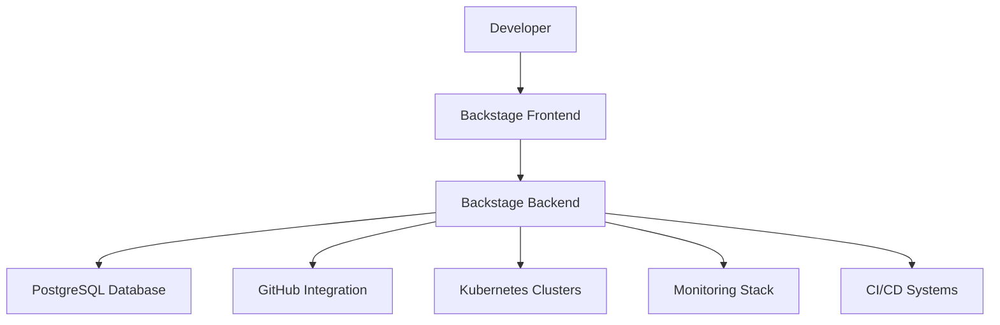

# Internal Developer Platform Documentation

Welcome to the Internal Developer Platform (IDP) documentation. This platform provides a comprehensive set of tools and services to accelerate software development and improve developer experience.

## Quick Start

- [Getting Started](getting-started.md)
- [Project Overview](project-overview.md) - 了解项目结构和 Spec 方法论
- [Git & GitHub Guide](git-github-guide.md) - Git 和 GitHub 使用指南
- [Local Development](local-development.md) - 本地开发环境设置
- [Deployment Guide](deployment.md) - AWS EKS 部署指南
- [CI/CD Guide](ci-cd-guide.md) - GitHub Actions CI/CD 配置
- [Service Catalog](service-catalog.md)
- [Golden Path Templates](templates.md)

## Features

### Core Platform

- **Service Catalog**: Centralized registry of all services and components
- **Golden Path Templates**: Pre-configured project templates for rapid development
- **Documentation System**: Automated documentation generation and publishing
- **Search & Discovery**: Powerful search across services, docs, and APIs

### Observability & Monitoring

- **Datadog Integration**: Real-time monitoring and alerting
- **Sentry Error Tracking**: Comprehensive error monitoring and resolution
- **Prometheus Metrics**: Custom metrics and performance monitoring
- **Grafana Dashboards**: Visual monitoring and analytics

### CI/CD & DevOps

- **GitHub Actions**: Automated CI/CD pipelines
- **Argo CD**: GitOps deployment management
- **Kubernetes Integration**: Container orchestration and management
- **Infrastructure as Code**: Terraform-based infrastructure management

### Developer Experience

- **API Documentation**: OpenAPI, AsyncAPI, and GraphQL documentation
- **gRPC Playground**: Interactive API testing and exploration
- **Developer Tools**: Utilities, converters, and debugging tools
- **Tech Radar**: Technology adoption tracking and decision support

## Architecture

The platform is built on [Backstage](https://backstage.io/) and follows cloud-native principles:

## Support

For questions and support:

- **Documentation**: Browse this documentation site
- **Issues**: Create issues in the platform repository
- **Slack**: Join the #developer-platform channel
- **Office Hours**: Weekly platform office hours

## Contributing

We welcome contributions to improve the platform:

1. Review the [Contributing Guide](contributing.md)
2. Check existing [Issues](https://github.com/your-org/platform/issues)
3. Submit pull requests with improvements
4. Participate in platform discussions
