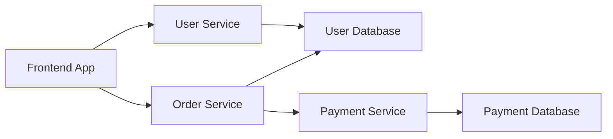

# Service Catalog

The Service Catalog is the central registry for all services, components, APIs, and resources in your organization.

## Overview

The catalog automatically discovers and registers services from your GitHub repositories, providing a unified view of your entire software ecosystem.

## Service Discovery

Services are automatically discovered through:

### GitHub Integration
- Scans repositories for `catalog-info.yaml` files
- Registers services, components, and APIs
- Updates metadata when files change

### Manual Registration
You can also manually register entities:

1. Navigate to **Catalog** → **Register Entity**
2. Provide the URL to your `catalog-info.yaml` file
3. Click **Analyze** and then **Import**

## Entity Types

### Components
Software components like services, libraries, and websites.

```yaml
apiVersion: backstage.io/v1alpha1
kind: Component
metadata:
  name: user-service
  description: User management microservice
  annotations:
    github.com/project-slug: myorg/user-service
spec:
  type: service
  lifecycle: production
  owner: team-backend
  system: user-management
```

### APIs
API definitions and specifications.

```yaml
apiVersion: backstage.io/v1alpha1
kind: API
metadata:
  name: user-api
  description: User management API
spec:
  type: openapi
  lifecycle: production
  owner: team-backend
  system: user-management
  definition: |
    openapi: 3.0.0
    info:
      title: User API
      version: 1.0.0
```

### Resources
Infrastructure resources like databases, queues, and storage.

```yaml
apiVersion: backstage.io/v1alpha1
kind: Resource
metadata:
  name: user-database
  description: PostgreSQL database for user data
spec:
  type: database
  owner: team-backend
  system: user-management
```

## Service Information

Each service in the catalog displays:

### Overview
- **Metadata**: Name, description, owner, lifecycle
- **Links**: Repository, documentation, monitoring
- **Dependencies**: Services and resources this component depends on
- **Dependents**: Services that depend on this component

### CI/CD Status
- **Build Status**: Latest pipeline results
- **Deployment Status**: Current deployment state across environments
- **Release History**: Recent releases and changes

### Monitoring
- **Health Checks**: Service health and availability
- **Metrics**: Performance and usage metrics
- **Alerts**: Active alerts and incidents

### Documentation
- **TechDocs**: Automatically generated documentation
- **API Docs**: OpenAPI/GraphQL specifications
- **Runbooks**: Operational procedures

## Dependency Graph

The catalog automatically builds a dependency graph showing:



## Search and Filtering

### Search Features
- **Full-text search** across all entity metadata
- **Tag-based filtering** by technology, team, or lifecycle
- **Owner filtering** to find services by team
- **Type filtering** by component, API, or resource

### Advanced Filters
- **Lifecycle**: production, experimental, deprecated
- **Technology**: java, go, react, python
- **System**: group related components
- **Owner**: filter by team or individual

## Best Practices

### Naming Conventions
- Use **kebab-case** for entity names
- Include **descriptive names** that indicate purpose
- Use **consistent prefixes** for related services

### Metadata Quality
- Provide **clear descriptions** for all entities
- Set appropriate **lifecycle stages**
- Define **ownership** for all components
- Add relevant **tags** for discoverability

### Dependencies
- Declare **all dependencies** explicitly
- Use **resource entities** for infrastructure
- Keep **dependency graphs** up to date

### Documentation
- Include **README** files in repositories
- Add **API documentation** for all APIs
- Maintain **operational runbooks**

## Troubleshooting

### Service Not Appearing
1. Check `catalog-info.yaml` syntax
2. Verify GitHub permissions
3. Check catalog processing logs
4. Manually refresh entity

### Outdated Information
1. Check last refresh timestamp
2. Trigger manual refresh
3. Verify webhook configuration
4. Check for processing errors

### Missing Dependencies
1. Ensure dependent services are registered
2. Check entity names match exactly
3. Verify dependency declarations
4. Review system boundaries